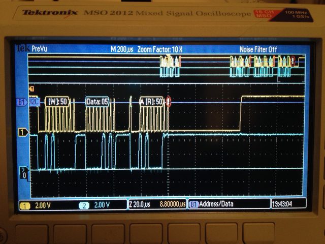
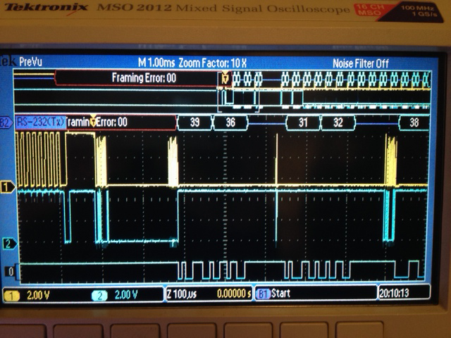

# Move RE

Arduino extension code:
https://github.com/opyh/move-arduino-extension

## February 16th 2014

### Fixing Mac build 

Issues with i386 and including AVFoundation framework had to be fixed before we could build the PSMove API on Raphaël's Macbook Pro. Raphaël submitted a pull request with the changes: [thp/psmoveapi#96](https://github.com/thp/psmoveapi/pull/96)

### PSMove Auth

We tested the utility that Alex developed on Raphaël's computer but message sending failed.

### Arduino communication

We though the TWI library had been updated but last message on the issue is from 8 month ago.

Alex mentions that the issue with Arduino is that users typically don't need the Arduino to be slave.
Sebastian says that the only case we stumbled upon so far is connecting two arduinos together and that it works with the current Wire library so no one had a reason to try and fix it.

Sebastian replaced the wire library with his own version (256 bytes buffer length).

We have a repository on Github for the project: https://github.com/opyh/move-arduino-extension

Alex explains the communication protocol between sharpshooter and move is supposed to work. In our case, at some point (not always the same), the slave stop doing anything. It manifests itself as a missing [ack](https://www.youtube.com/watch?v=wTDUuBWGtpU). The slave may have stopped working earlier but the master has no way to know until it's asking for an acknowledge.

Sebastian is looking at the state changes.
http://www.nongnu.org/avr-libc/user-manual/group__util__twi.html

Alex and Sebastian try to find where the slave gets stuck.

There is a lot of code in the TWI lib that is either really tricky to understand or doesn't make sense.

Our options as stated by Alex:

* Repair the obviously broken TWI library
* Implement our own solution for I2C interface on the Arduino
* Use another arduino compatible microcontroller (teensy 3?)

We have no idea why the Move is sending a second repeated start (resulting in a "bus error" state) when other parts of the interaction are not time critical. Alex could have a look in the move's firmware.

We will try the teensy first. If it doesn't work, we will have to do our own I2C implementation.

Teensy I2C Slave library: http://forum.pjrc.com/threads/21680-New-I2C-library-for-Teensy3

## March 1st 2014

Our goal for the day: get our I2C program running on the Teensy.

What we did:

* Soldering headers to the teensy 3.1 and 3.0
* Connect the Teensy where the UNO was on the breadboard (minus voltage converter)
* Download the **i2c_t3** library
* Run the code (yeah!)
* Remove external pullups, Teensy's internal pull-ups work fine

  The Teensy runs the code out of the box (with the i2c_t3 lib)

  It's gets its power directly from the move

* Sebastian fixed the build of psmoveAPI on Raphaël's MBP. 
* Raphaël disassembles both his controllers to check PCB revision
* Alex and Raphaël check the firmware version of Raphaël's two controllers. 
* We have the first working unofficial PS Move extension!

## Mail from Alex on March 2nd

As promised, I had another look at anything EXT-related I could find in the Move firmware. Here is my résumé:

(1) I have not found any code that touches the first 0x40 bytes of the EXT device's init data after reception from the EXT device.

This is a little strange since it contains a couple of non-zero bytes for the Sharp Shooter as well as the Racing Wheel. This could mean that there is some code that dynamically generates memory addresses that target this data. Very hard to find in a static analysis of the firmware. Chances are I have simply not found it yet. We should try to put other values in there and see what happens. :)

(2) The following 0x60 bytes (all zero in the Sharp Shooter and Racing Wheel init data), if non-zero, only seem to be sent back once by the Move after successful reception of the init data from the EXT device. We verified that in a quick test before we left yesterday. No other code touching it as far as I can tell.

This seems pretty useless at first sight. But it could actually be used to make the Move send some custom init data to the EXT device or any other I²C device (on the same bus as the EXT device) of our choice. Think of something that needs to be woken up or configured once before it starts proper operation. So, this block seems to be nothing but input for some kind of I²C "echo" service. Maybe you guys can think of another use?

So far, the only way to send/receive additional data to/from the EXT device seems to be HID Feature Report 0xE0 which I mentioned as a reminder in an email a few weeks ago. It lets us write a buffer of data that is later sent to the EXT device. Some form of result can then be read back using the same report.

This, I think, would be the most probable way for the PS3 to make the Racing Wheel rumble (or whatever else it can do). It would not make sense to encode something like this in the EXT device's init data because the Move cannot know *when* to rumble. The game on the PS3 has to decide that, I guess.

## March 16th 2014

### Summary

* Fixed Homebrew installation on Raphaël's computer
* Built the API again (but we have to disable building the tracker)
* Raphaël clones the git repo
* Raphaël installs teensyduino
* Note: Teensy will only supports Arduino IDE 1.0.5 until the library format for 1.5.x is specified
* We observe that there is no way to programmatically pull down the "enable" pin as the extension is not powered by the move until that pin is pulled down.
*  We verified that the slave address that you have to specify in the init sequence is used by the move to talk to the extension. 
* If your extension had several I2C interfaces, you could specify multiple addresses.
* We checked the I2C "echo" service on the move
* It looks like the first 64 bytes of the init sequence are just ignored by the Move
* Coding a utility to dump feature report 0xE0 from the move on a mac. Using a bluetooth connection always fails (timeout error). Using a USB doesn't work as the extension will only be powered if if the Move is connected via Bluetooth.

### To do list

* Use a linux virtual machine to get the feature report
* Fix the API's . Ask the author of Hidapi what could be the source of the timeout error. Make a minimal (not) working example.
* We should send the EXT device the request for the init data not only once but again at some later point in time. The answer probably contains data in fields that were not populated the first time.

